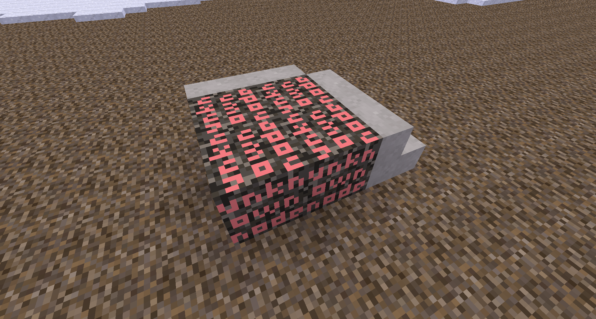

placeholder node / a better unknown node


[](license.txt)
[](https://content.minetest.net/packages/BuckarooBanzay/placeholder)

# Overview



Provides a "better" unknown node which can be handled properly by worldedit and other schematic mechanisms (given they support metadata).

Features:
* Handles and restores metadata
* Restores the original node and metadata if it is available (via lbm)
* Can be serialized and deserialized with worldedit

Use-cases:
* Schematic handling with unknown nodes

# Api

```lua
local pos = { x=0, y=0, z=0 }
local metadata = {
    inventory = {},
    fields = {
        x = "y"
    }
}
-- place a placeholder manually
placeholder.place(pos, {name="unknown:nodename"}, metadata)

-- unwrap the placeholder metadata (returns the original node- and metadata)
local meta = minetest.get_meta(pos)
local node, metadata = placeholder.unwrap(meta)

-- try to restore the placeholder at the position
-- this function gets also called in the placeholder-lbm for automatic restoration
placeholder.replace(pos)
```

# License

* Code: MIT
